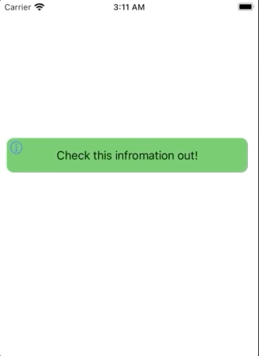

# expandable-view


# Description

You can create an instance of this view like so if you calculate frame manually:
```
var myView: ExpandableView = ExpandableView(frame: rect, message: "yadayada", note: "describing info")
```

OR you might use convenience initialization and probably apply soe constraints.
```
var myView: ExpandableView = ExpandableView(message: "yadayada", note: "describing info")
// setup constraints
```

# License and usage

Feel free to fork, use, play around and improve this code
